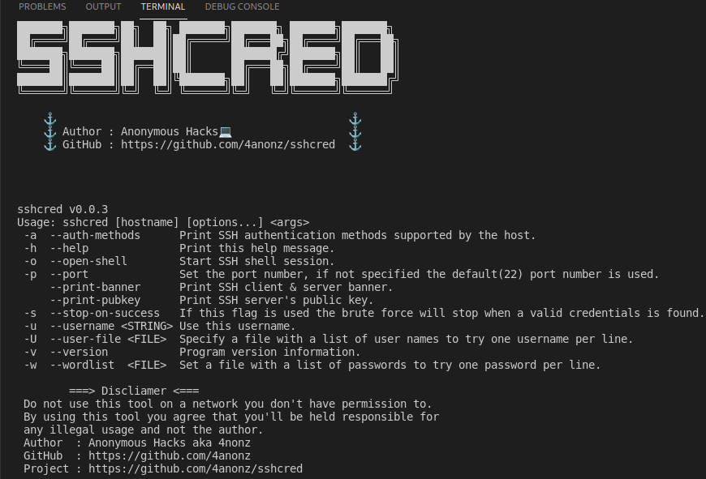

# SSHCRED
sshcred is an information gathering and brute-force tool for SSH(Secure Shell) protocol.
sshcred also allows you to open shell session for executing remote commands.

# About sshcred v0.0.3
* bugs fixed
* brute force speed is improved
* opening shell sessions

# Platforms
* Linux
* Windows
* macOs
* Termux (Android)

# Requirements

* C++ compiler
* OpenSSL library
* libssh library

The only things needed to run sshcred is OpenSSL, libssh and a C++ compiler,
I recommend using gcc/g++ on Unix-Based OS, MinGW on windows and clang on termux

# Screenshots



# Installing libssh - Linux & Termux
```
apt-get install libssh-dev
```
# Installing sshcred - Linux & Termux
```
git clone https://github.com/4anonz/sshcred.git
cd sshcred
make
sshcred --help
```
# Installing sshcred - Windows
You'll first need to install the OpenSSL and libssh on
windows after you.ve done that you run this command on
command prompt.
```
cd sshcred
g++ -c src/sshcred.cpp
g++ -c src/shell/shell.cpp
g++ src/main.cpp sshcred.o shell.o -lssh -o sshcred
.\sshcred.exe --help
```

Everything is for educational purposes as usual.
Do follow me on GitHub  if you appreciate my hard work and for more projects like this.

# Get in touch
<a href="mailto:digitalguru64@gmail.com" action='_blank'> Send email </a>
* Feedback is always welcome!
